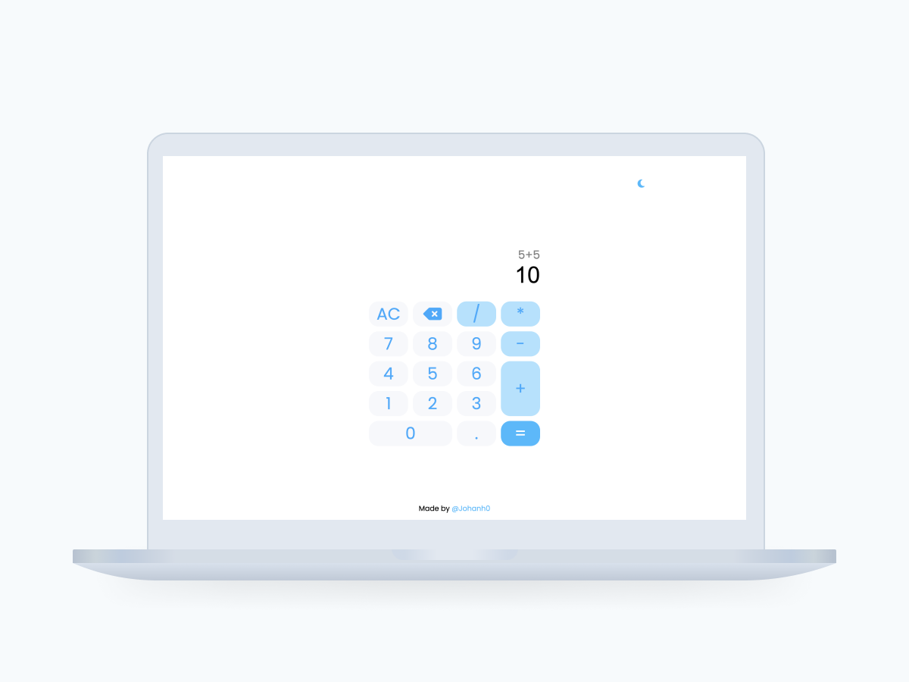
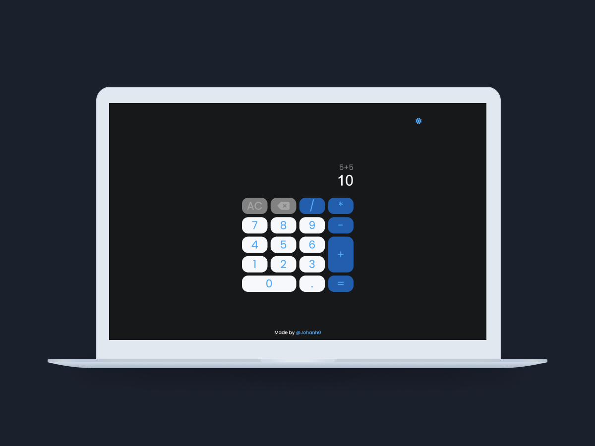

# Calculator

This project is a simple **calculator** built using **HTML**, **CSS**, and **JavaScript**. It features advanced functionality to calculate mathematical expressions following the **PEMDAS** order of operations. The calculator also includes error handling to alert the user if there’s an attempt to divide by zero. Additionally, it supports both **Dark Mode** and **Light Mode** for a customizable user experience.

### Key Features

- **PEMDAS Support**: The calculator correctly follows the order of operations (Parentheses, Exponents, Multiplication and Division, Addition and Subtraction) when evaluating expressions.
- **Zero Division Error**: If a user tries to divide by zero, the calculator displays an alert notifying them that division by zero is not possible.

- **Dark & Light Mode**: Users can switch between dark and light themes, allowing for a personalized interface suitable for different lighting conditions.

- **Responsive Design**: The layout is fully responsive, ensuring a great user experience on both desktop and mobile devices.

- **Intuitive Interface**: A clean, user-friendly design with clearly labeled buttons, making the calculator easy to use for anyone.

### Technologies

- **HTML**: The structure of the calculator interface is built using HTML5.
- **CSS**: Styling is done with plain CSS, ensuring the app is visually appealing and responsive.

- **JavaScript**: The core functionality, including the PEMDAS calculations, zero division check, and theme toggling, is handled using JavaScript.

### Screenshots

### How to Use

1. **Enter a mathematical expression**: Use the number and operator buttons to input an expression or also use the input typing.
2. **Press "=" or Enter** to calculate the result, which will respect the order of operations (PEMDAS).
3. **If dividing by zero**, an alert will inform you that the operation is not allowed.
4. **Toggle between Dark Mode and Light Mode** by clicking the mode switch button at the top of the calculator.

### Deployment

To try out the live version of the project, click the following link:

[Live Demo](https://johanh0.github.io/Calculator/)
